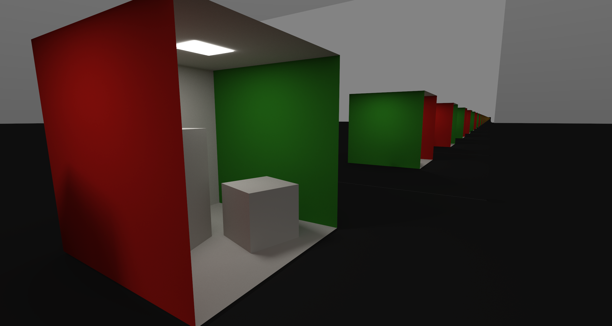

# Real Time Ray Tracing
Vulkan rendering engine with hardware acceleration for real-time ray tracing and interactive path tracing.

## Getting Started
This application was developed in Visual Studio 2022, so it is recommended to use Visual Studio 2022 (Also we only have a build option for Visual Studio 2022, so you should probably use it). We currently do not have any support for other platforms.

In the current state, all third-party dependencies must be downloaded and setup by the user. The following instructions show this process.

First, clone the repository.

```
git clone https://github.com/Tavonput/RealTimeRayTracing
```

After you have the repository, there are five dependencies that we require the user to download themselves, [VulkanSDK](https://vulkan.lunarg.com/), [GLFW](https://www.glfw.org/download.html), [GLM](https://github.com/g-truc/glm), [spdlog](https://github.com/gabime/spdlog), and [premake5](https://premake.github.io/).

Download the latest [VulkanSDK](https://vulkan.lunarg.com/). The directory should look something like this...

```
VulkanSDK / <version> / <all of the SDK directories and files>
```

Make sure that the root directory of the SDK is **VulkanSDK** and there is only one subdirectory in it which should be named the version that you downloaded. Then move the entire VulkanSDK directory into Vendor.![alt text]

```
/
|-- RayTrace/
|-- Scripts/
|-- Vendor/
|   |-- GLFW/
|   |-- GLM/
|   |-- PreMake/
|   |-- spdlog/
|   |-- VulkanSDK/
|       |-- <your version>/
|           | ...
|-- .gitignore
|-- premake5.lua
```

Download the **64-bit Windows Binaries** for [GLFW](https://www.glfw.org/download.html). Move the `include` and `lib-vc2022` directories into the GLFW directory under Vendor.

```
|-- Vendor/
|   |-- GLFW/
|       |-- LICENSE.md
|       |-- include/
|       |-- lib-vc2022/
```

Go to the [GLM GitHub Repository](https://github.com/g-truc/glm) and either clone or download it. There should be a directory called `glm`. Move that directory into the GLM directory under Vendor.

```
|-- Vendor/
|   |-- GLM/
|       |-- copying.txt
|       |-- glm/
```

Go to the [spdlog GitHub Repository](https://github.com/gabime/spdlog) and either clone or download it. There should be a directory called `include`. Move that directory into the spdlog directory under Vendor.

```
|-- Vendor/
|   |-- spdlog/
|       |-- LICENSE
|       |-- include/
```

Download the latest version 5 of [premake](https://premake.github.io/). Grab just `premake5.exe` and place it into the PreMake directory under Vendor. 

```
|-- Vendor/
|   |-- PreMake/
|       |-- LICENSE.txt
|       |-- premake5.exe
```

Run `build_windows.bat` in the Scripts directory to build the Visual Studio 2022 solution. Now you should be able to open the solution `RayTrace.sln` and build the project. Try pressing `F5` to build and run the project. Also note, all binaries (executables, objs, ...) will be sent to the directory Bin.

## Gallery
Models from [https://casual-effects.com/data/index.html](https://casual-effects.com/data/index.html).


